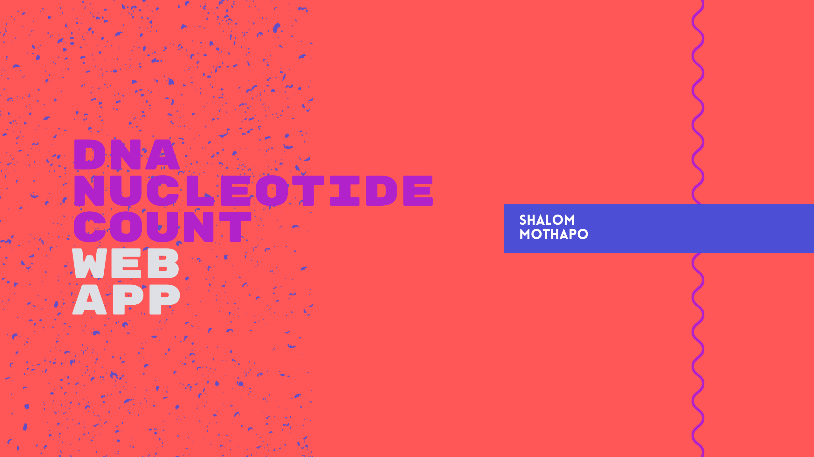

# DNA Nucleotide Count Web App
## This app takes the input of a nucleotide DNA sequence and counts the composition of the DNA
- This app will display bar chart and dataframe of the DNA composition as well

# How To Run The App:
- Enter `streamlit run myapp.py` in terminal to run the app in you browser.
- Enter DNA sequence in the text box and press ctrl+Enter to execute.

# Neoclide DNA:
[Nucleotides](https://en.wikipedia.org/wiki/Nucleotide) are organic molecules consisting of a nucleoside and a phosphate. They serve as monomeric units of the nucleic acid polymers deoxyribonucleic acid (DNA) and ribonucleic acid (RNA), both of which are essential biomolecules within all life-forms on Earth. Nucleotides are obtained in the diet and are also synthesized from common nutrients by the liver.

Nucleotides are composed of three subunit molecules: a nucleobase, a five-carbon sugar (ribose or deoxyribose), and a phosphate group consisting of one to three phosphates. The four nucleobases in DNA are guanine, adenine, cytosine and thymine;

[Nucleotide sequences](https://www.sciencedirect.com/topics/immunology-and-microbiology/nucleotide-sequence) are used to predict the amino acid sequences of proteins, and to construct DNA probes and peptides that are used in many immunological studies.